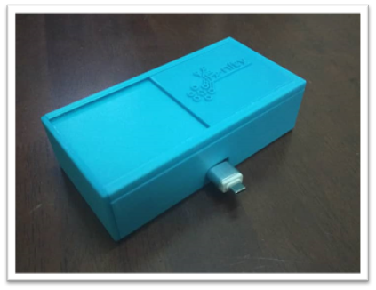

# Smartphone-Based-Contactless-Thermometer

Develop contactless thermometer to meet the demand under the Covid-19 pandemic situation from 2019. The main feature of this type thermometer is the capability to be paired with a mobile app to display readings of body temperature and store the data of body temperature. This thermometer is also designed to be contactless, portable, light weighted and battery-less. 

The figure below is our project image (Smartphone-Based-Contactless-Thermometer):

                

Hardware Components:
* Thermal Infrared sensor
* Arduino Nano
* LED
* Ultrasonic Sensor
* OTG converter
* Wires

Software Requirements:
* AutoCAD
* EasyEDA
* Android Studio (flutter)
* Arduino IDE

[Demo Video & User Manual](https://www.youtube.com/watch?v=LB4F7s-LmH8&list=PPSV)

